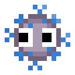
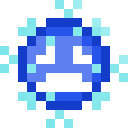

# Mc(Hack)fee Antivirus 2022 - Pan(demic)-Man

This project was built for [McHacks 9 - 2022](https://www.mchacks.ca), a virtual, 36-hour hackathon. Our goal was to learn more about game development, so we created a COVID-themed spoof of the classic '80s arcade game: Pac-Man. 

_Project made with_ ❤️ _by [Nathalie](https://github.com/nredick), [Elinor](https://github.com/elinorpd) and [Alex](https://github.com/allu5662)._

## ✍️ Project Description

Oh no! Pac-Man is being hunted by COVID-19 variants: Alpha (Pink), Beta (Beta), Delta (Orange), and Omicron (Green). Classic game pieces ('sprites') like ghosts, power pellets, and fruits have been replaced by things we are all now unfortunately familiar with: COVID-19 variants, face-masks, vaccine syringes, hand sanitizer, and more.

<!-- In the hopes of creating an educational gamespace, there are informative messages about COVID safety between game rounds.-->

## 💡 Inspiration
This project was inspired by our desire to dive into the world of game development, an area our team was unfamiliar with. We approached this hackathon with learning being the main end goal of our project. The idea for the game itself was, in no small part, inspired by the realities of the current pandemic and of course, Pac-Man. 

## ⚙️ How we built it
The game was built on the Unity game development platform using C# and is largely based on a tutorial by Zigorous ([YouTube](https://youtu.be/TKt_VlMn_aA), [Github](https://github.com/zigurous/unity-pacman-tutorial)). We would like to credit the original author and emphasize that we approached this hackathon purely as a learning experience. 

The sprites were custom made by our team just for this project, see them in all of their glory below!

## 🚧 Challenges we ran into
The Unity platform has a big learning curve, especially since no one on our team was familiar with C#. We ran into quite a few roadblocks trying to find settings and functions we had never used before. 

## 🏆 Accomplishments that we're proud of
We're definitely very proud of the game as a whole and the creativity that went into making it possible. 

## 🕹 What we learned
We learned a lot more about the game development process, the Unity platform, and the rules of Pac-Man. The physics behind the movements of Pac-Man and ghosts was particularly fun to learn about and code! 

And at least for some of us, that game development is not a career path we'll be pursuing. 

## Custom Sprites

**COVID-19 "Ghost" Variants:**

**Vulnerable ghosts:**

**Face-mask "power pellets":** 

**Vaccine syringe, hand sanitizer, and pill -themed "fruits":**

## Demo

## Repository Organization

